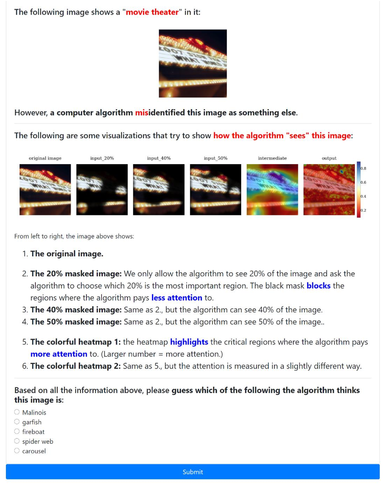

# Human Evaluation on Interpretation by GuessWrongLabel

*GuessWrongLabel* **User Interface (UI)** was developed to support the paper:

* *How Useful Are the Machine-Generated Interpretations to General Users?A Human Evaluation on Guessing the Wrongly Predicted Labels.*
  Hua Shen, Ting-Hao (Kenneth) Huang.
  The 8th AAAI Conference on Human Computation and Crowdsourcing (HCOMP), 2020.

## Usage

####  User Interface for Evaluating Interpretation by General User:
**User Interface** of two experimental conditions, including [Interpretation] and [No-interpretation], are both provided in this repo with six examples.
* UI for [No-Interpretation] condition is in *"/No_Interpretation_Interface/"* with original images in *"/condition1/"*;
* UI for [Interpretation] condition is in *"/Interpretation_Interface/"* with images and saliency maps in *"/condition2/"*.

####  User Interface Demo:

<!-- <object data="https://github.com/huashen218/GuessWrongLabel/blob/master/UI_Interface_Demo.pdf" type="application/pdf" width="700px" height="700px">
    <embed src="https://github.com/huashen218/GuessWrongLabel/blob/master/UI_Interface_Demo.pdf">
        
This browser does not support PDFs. Please download the PDF to view it: <a href="https://github.com/huashen218/GuessWrongLabel/blob/master/UI_Interface_Demo.pdf">Download PDF</a>.

    </embed>
</object> -->

####  Machine-generated Interpretations:
The machine-generated interpretation codes using *Pytorch* is in *"/machine_generated_interpretation/"*.

## Full paper access

The full paper can be found
[here](https://github.com/huashen218/GuessWrongLabel/tree/master).